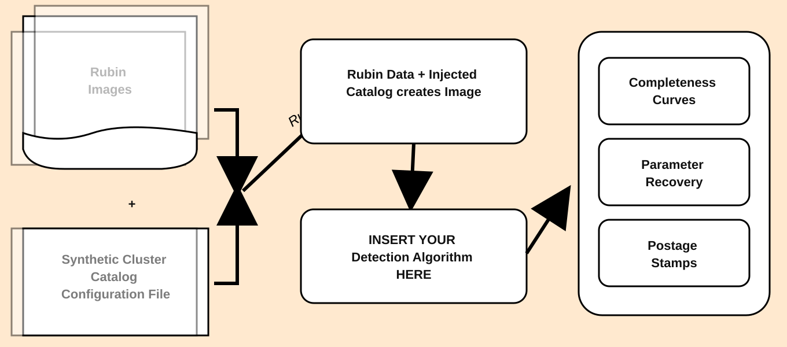

# Star Cluster Injection Pipeline

  
Documentation

  <h1>Star Cluster Injection Pipeline</h1>
  
Install the package, run injection-recovery experiments, compare detection behavior, and document completeness in a reproducible way.

  <a class="hero-btn" href="getting-started/installation/">Installation</a>

## What is INJECT?
- INJECT is a Rubin/LSST-oriented injection pipeline for artificial star clusters.
- It supports both smooth light-profile injections and discrete-star cluster generation.
- It is built for injection-recovery science: generate a truth catalog, inject into data, run your detector, and measure recovery or completeness as a function of the parameters you care about.
- It is intentionally customizable so users can vary profile family, magnitude range, size range, PSF behavior, band selection, batching strategy, and downstream detection logic.

## Pipeline Overview

<figure class="flowchart-figure">
  
</figure>

## What Users Usually Do

- Run a quick mock-data injection locally to validate environment setup.
- Switch to TAP-mode cutouts for remote, lightweight Rubin access.
- Use Butler/RSP mode for higher-fidelity PSF-aware runs on Rubin infrastructure.
- Run repeated batches to build recovery curves and completeness summaries.
- Save configuration snapshots and outputs so science comparisons stay reproducible.

## Who This Is For

- Astronomers prototyping injection-recovery studies and completeness measurements.
- Pipeline developers building reproducible simulation workflows.
- Collaborators who need notebook-first examples and script automation.

## Doesn't Rubin already have an INJECT tool?

- Rubin already includes injection tooling, but this project is meant to be more experimental and configurable for cluster-centric studies.
- The main differentiators here are profile choice, discrete-star generation, parameter sweeps, PSF-focused experimentation, and user-controlled downstream benchmarking.

## Quick Links

- [Installation](getting-started/installation.md)
- [Quickstart](getting-started/quickstart.md)
- [Use Cases](guides/use-cases.md)
- [Customization](guides/customization.md)
- [Pipeline Workflows](guides/pipeline-workflows.md)
- [Deployment](guides/deployment.md)
- [PSF Caching and Performance](guides/psf-caching.md)
