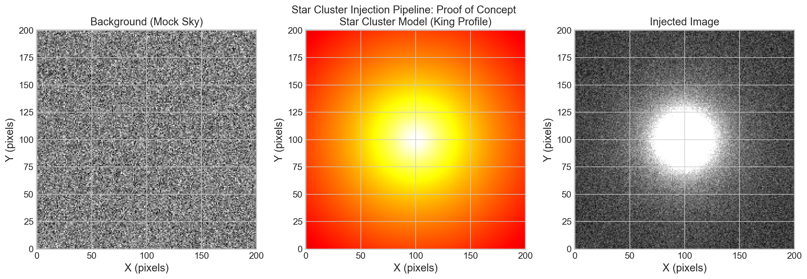
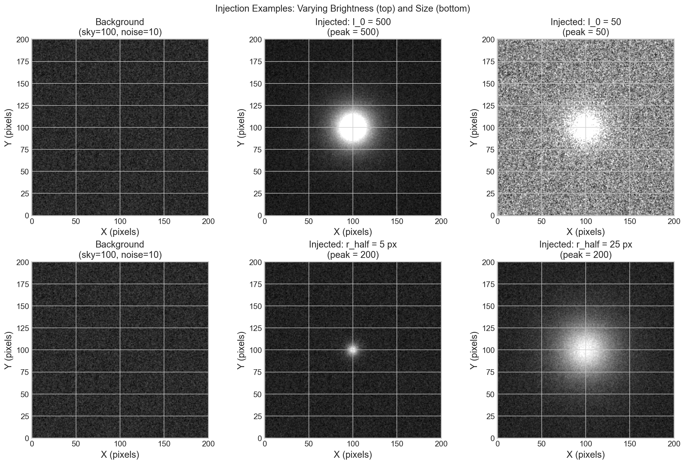
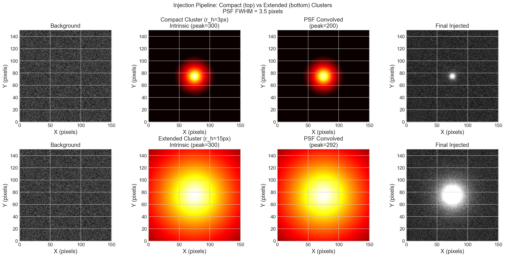
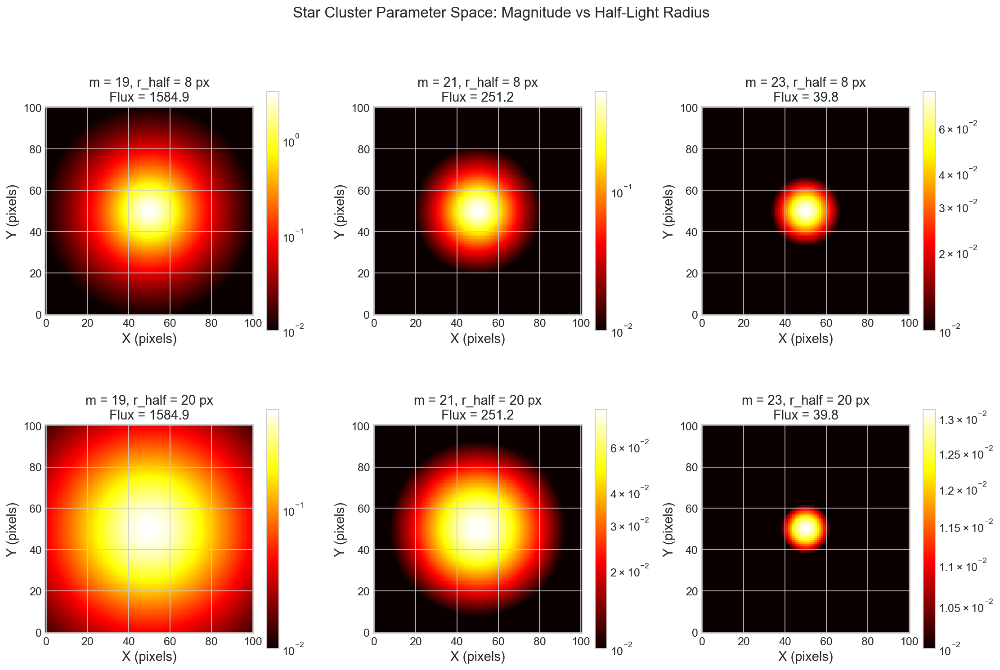
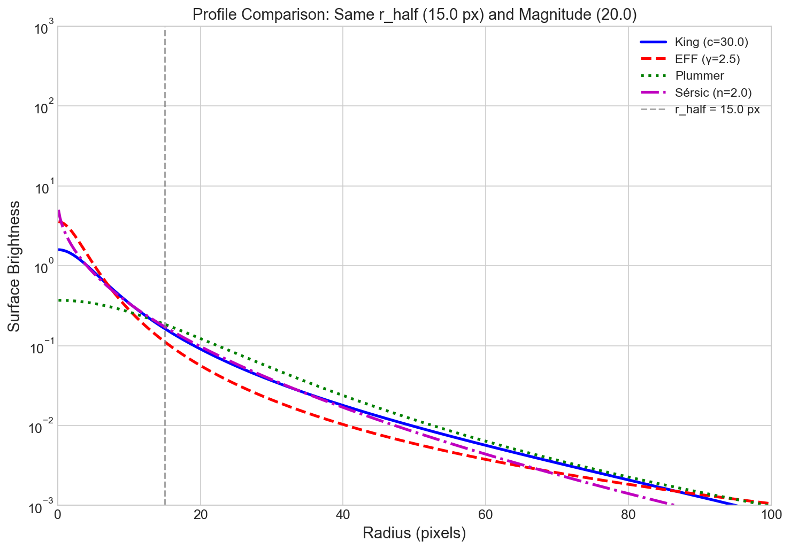
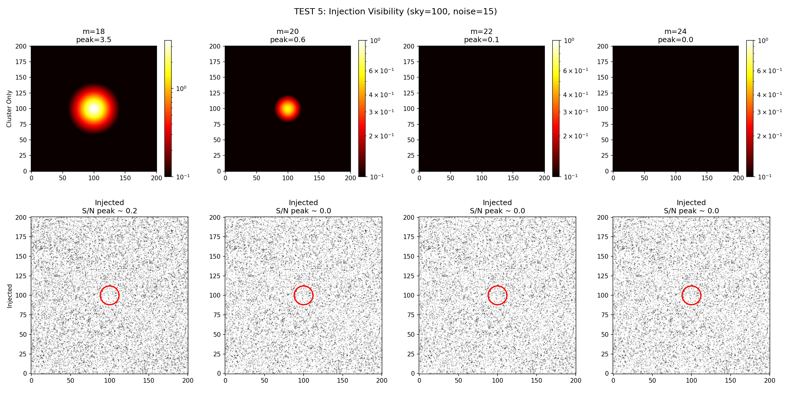

# Plot Gallery

This page shows a small set of representative outputs from the pipeline so users can quickly see the kinds of figures the package can generate.

## What These Plots Demonstrate

- How injected clusters appear in image space
- How profile choices change morphology
- How PSF convolution affects the final signal
- How parameter space exploration can be visualized

## Example Outputs

  <figure>
    
    <figcaption>Single injection example.</figcaption>
  </figure>
  <figure>
    
    <figcaption>Variation across different injection setups.</figcaption>
  </figure>
  <figure>
    
    <figcaption>Injected sources after PSF treatment.</figcaption>
  </figure>
  <figure>
    
    <figcaption>Parameter space grid used for systematic exploration.</figcaption>
  </figure>
  <figure>
    
    <figcaption>Comparison of supported cluster light profiles.</figcaption>
  </figure>
  <figure>
    
    <figcaption>PSF-focused injection diagnostic.</figcaption>
  </figure>

