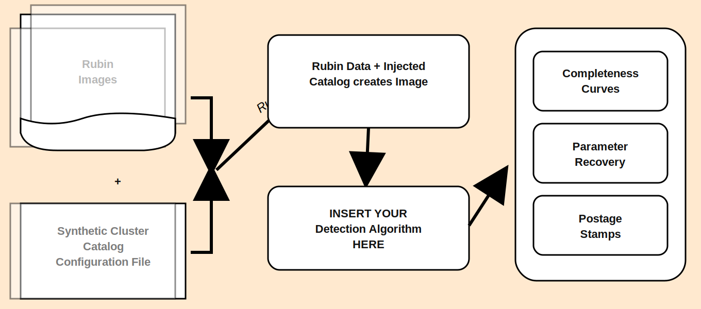

# Star Cluster Injection Pipeline

  
Documentation

  <h1>Star Cluster Injection Pipeline</h1>
  
Install the package, run injections, test recovery, and review completeness results.

  <a class="hero-btn" href="getting-started/installation/">Installation</a>

## What is INJECT?
- INJECT is in essence a "plug and play" pipeline built for Rubin data, It allows users to benchmark their detection algorithms and  retrieve completeness and recoverys estimations designed to help you understand where you may be falling short. 
- INJECT allows user to generate simulated catalogs of star clusters in one of two ways: using a 2D light profile to represent a star cluster or discretely generating stars in a cluster and then convolving them. The latter of the is clearly more computational heavy. 
- You are able to customize 'almost' every step of the process: the profile type, the radius, magnitude, psf, etc when generating a simulation. So let's say you need to ensure you are recovering at least 45\% of the dim young star clusters. You generate clusters in that range inject into image, run detection pipeline, use the second half of INJECT to produce your recovery and estimation parameters.  

## Pipeline Overview

<figure class="flowchart-figure">
  
</figure>

## Documentation Map

- **Getting Started**: environment setup, package dependencies, and first run.
- **Guides**: practical workflows for notebook and script users.
- **Reference**: commands, module responsibilities, and testing patterns.

## Who This Is For

- Astronomers prototyping injection-recovery studies. This is primarily a benchmarking tool to help users compare their efficacy of their detection pipelines.
- Pipeline developers building reproducible simulation workflows.
- Collaborators who need notebook-first examples and script automation.

## Doesn't Rubin already have an INJECT tool?

- Yes Rubin does already have a INJECT tool baked into their packages. However, the injection tool is quite sparse and doesn't allow users the flexibility of being able to chose between let's say a 2D light profile to simulate a cluster or generating individual stars in the cluster. Furthermore, you are unable to vary the light profiles by type, by size, by magnitude, INJECT gives that to you!

## Quick Links

- [Installation](getting-started/installation.md)
- [Quickstart](getting-started/quickstart.md)
- [Pipeline Workflows](guides/pipeline-workflows.md)
- [PSF Caching and Performance](guides/psf-caching.md)
